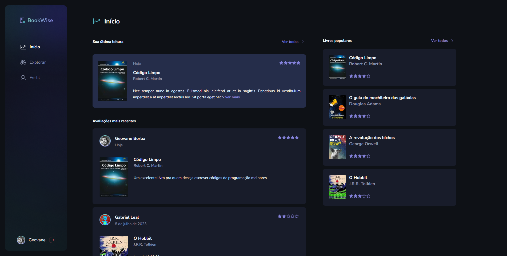

<p align="center">
  
   
  
</p>

<p align="center">
  <a href="#dart-sobre">Sobre</a> &#xa0; | &#xa0;
  <a href="#rocket-tecnologias">Tecnologias</a> &#xa0; | &#xa0;
  <a href="#warning-pré-requisitos"> Pré requisitos</a> &#xa0; | &#xa0;
  <a href="#checkered_flag-começando">Começando</a> &#xa0; | &#xa0;
  <a href="#memo-licença">Licença</a> &#xa0; | &#xa0;
  <a href="https://github.com/geovaneborba" target="_blank">Autor</a>
</p>

<br>

## :dart: Sobre

<p>
  Desafio realizado durante o programa ignite da <a href='https://www.rocketseat.com.br/' target="_blank">Rocketseat</a>, onde
  foi solicitado o desenvolvimento de uma plataforma de recomendações para leitores, um lugar onde eles possam avaliar e ver avaliações de outros leitores sobre os mais diversos livros. Foi implementado as seguintes funcionalidades:

- Autenticação utilizando uma conta do Google ou Github
- Limite de algumas funcionalidades para usuários não autenticados
- Listagem de avaliações realizada por usuários
- Listagem com os livros populares (que contém mais avaliações)
- Dialog (modal) contendo informações ao visualizar um livro
- Formulário para avaliar um livro
- Formulário para editar uma avaliação já existente
- Filtrar livros por nome ou autor
- Filtrar livros por categoria
- Perfil com filtro de livros avaliados e estatística de páginas lidas, categoria mais lida, autores lidos e livros avaliados

Foi trabalhado conceitos importantes do Next.js como por exemplo:

- Server-side Rendering (SSR)
- Static Side Generation (SSG)
- API Routes
- Dynamic Routes
- Images & Fonts Optimization

🎯 <a href="https://efficient-sloth-d85.notion.site/Desafio-06-Criando-uma-aplica-o-Fullstack-d85bc26f34754d0590b6116a35c9de23" target="_blank">Clique aqui para acessar o desafio ⬅️</a>

</p>

<p align="right">(<a href="#top">Voltar para o topo</a>)</p>

## :rocket: Tecnologias

As seguintes tecnologias foram usadas na construção do projeto:

- [Next.js](https://nextjs.org/)
- [NextAuth.js](https://next-auth.js.org/)
- [TypeScript](https://www.typescriptlang.org/)
- [Styled Components](https://styled-components.com/)
- [Eslint](https://eslint.org/)
- [Prettier](https://prettier.io/)
- [React Hook Form](https://react-hook-form.com/)
- [ZOD](https://github.com/colinhacks/zod)

<p align="right">(<a href="#top">Voltar para o topo</a>)</p>

## :warning: Pré-requisitos

Antes de começar, você precisa ter o [Git](https://git-scm.com) e o [Node](https://nodejs.org/en/) instalados em sua maquina. Além disso, você também vai precisar de um container rodando uma imagem do PostgreSQL. Você também vai precisar definir as variáveis ambiente de acordo com o .env.example

<p align="right">(<a href="#top">Voltar para o topo</a>)</p>

## :checkered_flag: Começando

```bash
# Clone este repositório
$ git clone https://github.com/geovaneborba/ignite-bookwise.git

# Entre na pasta
$ cd ignite-bookwise

# Instale as dependências
$ npm install

# Para criar as tabelas do banco de dados
$ npx prisma migrate dev

# Inserir alguns livros, avaliações e usuários fakes
$ npx prisma db seed

# Para iniciar o projeto
$ npm run dev

# O app vai inicializar e será informado no terminal o endereço e porta onde estará rodando a aplicação
# geralmente é http://localhost:3000/
```

<p align="right">(<a href="#top">Voltar para o topo</a>)</p>

## :memo: Licença

Este projeto está sob licença MIT. Veja o arquivo [LICENSE](LICENSE.md) para mais detalhes.

<p align="right">(<a href="#top">Voltar para o topo</a>)</p>

<p align="center">Feito com ❤️ por <a href="https://github.com/geovaneborba" target="_blank">Geovane Borba</a></p>
